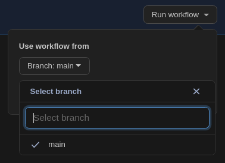

# pi-bootstrap
A repository that shows how to use Pi-Gen and Github Actions to create a ready-to-use Raspberry Pi image that includes connectivity to your home Wi-Fi, custom packages and build steps without opening a terminal or any manual setup. You can do all of this directly within the Github UI, which significantly lowers the barrier of entry for novice users, who don't need to understand a lot of the technical details.

:gear: This repository is intended as a basic template for developers who wish to create ready-to-use bootstrap repositories meant for novice users. See [aniongithub/raspotify-appliance](https://github.com/aniongithub/raspotify-appliance) for an example of a repository meant for novice end-users to use directly

## Github Actions Usage

1. Click and create a new public/private repository in your account based on this template.

   :warning: *If you plan to use this repository to create a ready-to-use image that includes your Wi-Fi SSID, passphrase or other private information, it is recommended to create a private repository at this stage*

2. Navigate to and then  (in the sidebar)

3. Add secrets and values for the following supported arguments as required. 

   :gear: *If you're a developer creating templates for other users, you can skip this step to use safe defaults you can test with*

| Name                | Description                                                  |
| ------------------- | ------------------------------------------------------------ |
| **IMAGE_NAME**      | This is the name of the generated image. Defaults to the name of the repository you created in step 1 |
| **FIRST_USER**      | The username of the first user on the generated image. Defaults to *pi* |
| **FIRST_USER_PASS** | The password for the first user on the generated image. Defaults to *raspberry* |
| **HOSTNAME**        | The name with which your newly booted pi will identify itself to any networks. Defaults to *IMAGE_NAME* |
| **SSH_ENABLED**     | 1 to enable SSH, 0 to disable SSH. Defaults to *1*           |
| **WPA_COUNTRY**     | Two-character ISO-3166-1 alpha-2 country code for your country. *Not setting this will keep Wi-Fi disabled via rfkill* |
| **WPA_SSID**        | SSID of your Wi-Fi network, if you want to enable Wi-Fi connectivity. *Not setting this will keep Wi-Fi disabled via rfkill* |
| **WPA_PASSPHRASE**  | Passphrase of your Wi-Fi network, if you want to enable Wi-Fi connectivity. *Not setting this will keep Wi-Fi disabled via rfkill* |

4. Navigate to the  tab and then edit [bootstrap/00-packages](bootstrap/00-packages) to add or remove any packages your custom image might need

5. Optionally, you can edit [config](config), [bootstrap/01-run.sh](bootstrap/01-run.sh) and/or [bootstrap/02-run.sh](bootstrap/02-run.sh) to add, remove or re-order custom installation steps and commit your changes
   :gear: See [.github/workflows/manual.yml](.github/workflows/manual.yml) for an example of how to add custom secrets that are then propagated to [config](config) via [pi-gen/build-docker.sh](pi-gen/build-docker.sh) to any custom build steps you create

6. Finally, to build an image for testing, navigate to and select the workflow. You can then pick the branch want to build
   

7. Click  and wait for the workflow run to finish. This may take 30+ minutes, depending on the packages and custom installation steps you've selected

   :warning: Free Github accounts only come with 2000 minutes of (Linux) Actions usage per month, so be careful with your usage minutes!

8. Once the workflow completes successfully, you will be able to download the image it built for you

   :warning: Make sure to delete or hide any artifacts that may contain sensitive information. Your secrets will not be propagated to any repositories created using your template, but artifacts and logs may be visible to anyone who can see the repository

9. Burn the image from step 8 onto a microSD card using [Imager](https://www.raspberrypi.org/software/), Etcher](https://www.balena.io/etcher/) or another program of you choice.

10. Pop the microSD card into your pi, power it up and wait for it to boot (green light stops flickering). Test your custom image and repeat steps 4-9 as needed

11. Once you're happy with your custom image, you can create a release to lock in that configuration for posterity. Go to the tab and click on the right. Enter all release details and hit 

12. Wait for the release workflow to finish and you should see your new release appear in the  section along with your newly-minted image (and the source code packages it was built from)

13. Burn your custom image onto a microSD card using [Imager](https://www.raspberrypi.org/software/) or [Etcher](https://www.balena.io/etcher/) and start using it in your Raspberry pi!

